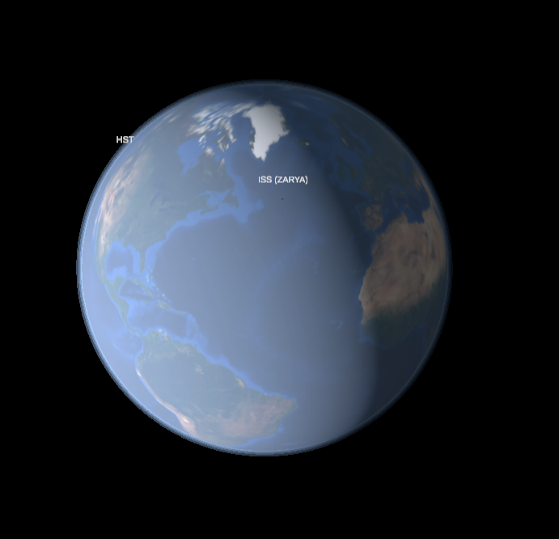
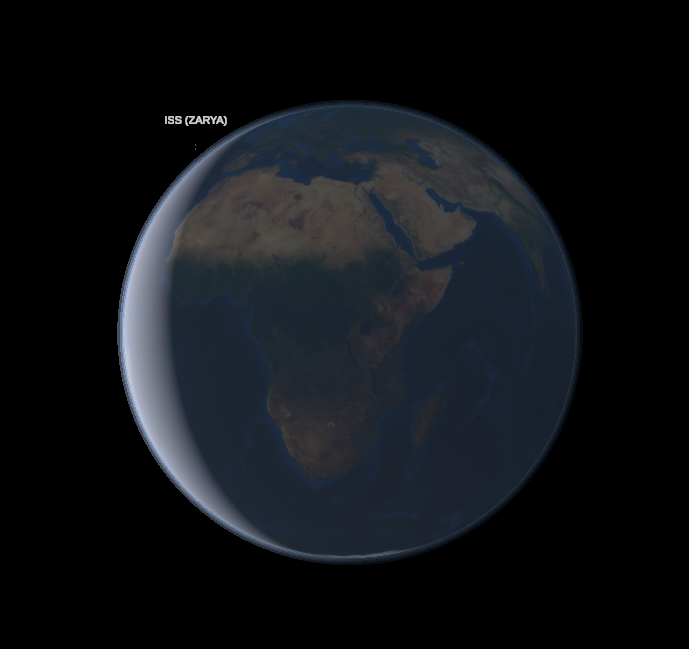
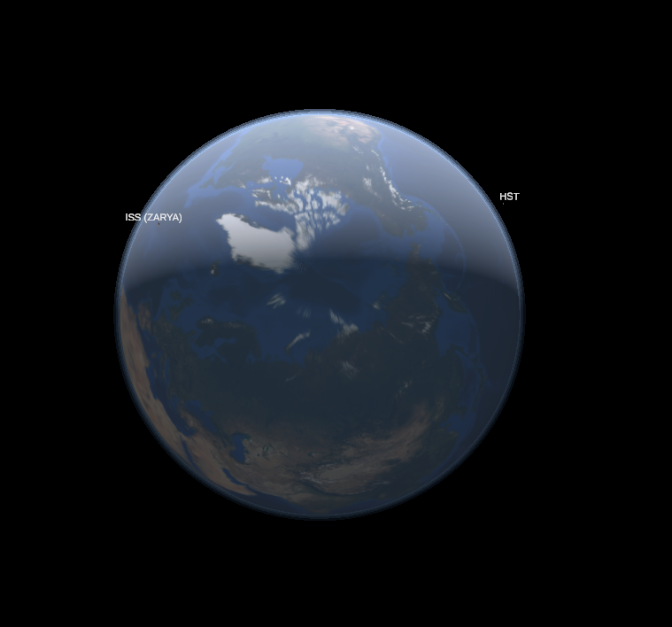
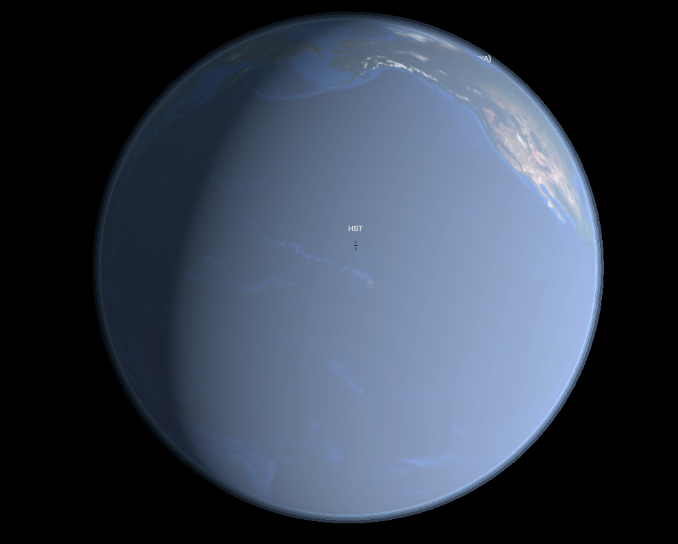
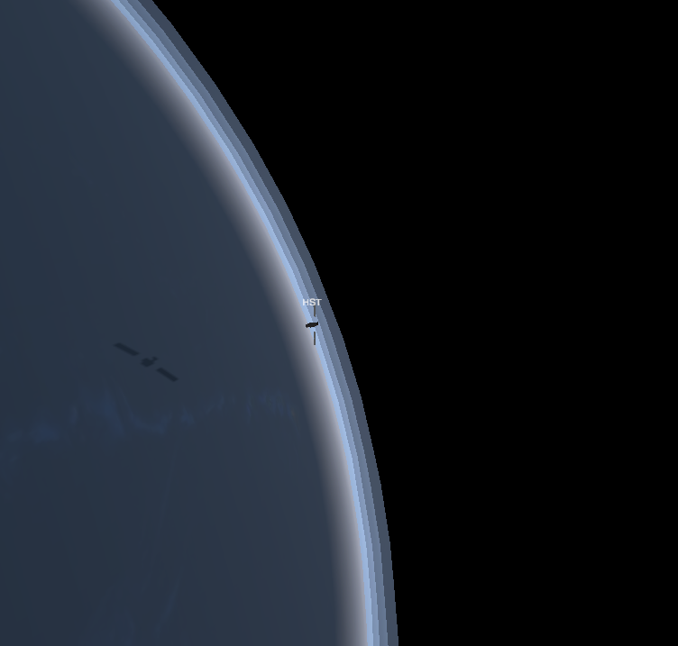

# Project BoneStar

A pipeline for turning GMAT-propagated spacecraft orbits into a live, browser-viewable
scene. GMAT does the orbital mechanics; the browser side (WebVerse) only ever consumes
state and interpolates for playback -- it does no orbital computation itself.

The current test case tracks the **ISS** and the **Hubble Space Telescope** from their
public TLEs.

<p align="center">
  
</p>

## Pipeline

```
tle/<catalog number>.tle         TLEs from any outside source (CelesTrak for the test case)
        |
tools/run_fleet.py               runs GMAT headless: SGP4 propagation of each TLE
        |
data/oem/<catalog number>.oem    one CCSDS OEM per spacecraft (EME2000, 60 s steps,
        |                        1 hour before the run to 12 hours after it)
        v
data/fleet.json                  all spacecraft merged for the viewer, plus GMAT's Earth
        |                        rotation angle and Sun direction for the window
webverse/Scripts/orbit.js        fetches it over HTTP and flies each spacecraft in real time
```

## Layout

```
tle/      input TLEs, one file per spacecraft: name line + the two element lines
tools/    run_fleet.py (the fleet job), gmat_to_webverse.py (single-orbit demo converter)
gmat/     GMAT scenario scripts (the single-orbit demo)
data/     generated output: OEMs, JSON, the generated GMAT script (not committed)
models/   probe.glb (spacecraft), earth.glb (NASA Blue Marble globe, unit radius),
          atmosphere.glb (glow shells, unit = Earth radius)
webverse/ the WebVerse world: index.veml (scene) + Scripts/orbit.js (playback, camera)
```

## Running it

Run the fleet job (needs GMAT R2026a; set `GMAT_CONSOLE` if it isn't at
`F:\gmat-win-R2026a\bin\GmatConsole.exe`):

```
python tools\run_fleet.py
```

It checks each TLE (line length, checksum), writes `data/fleet_run.script`, runs
GmatConsole headless, and writes `data/oem/*.oem` and `data/fleet.json`. This is the step
to schedule, e.g. every 6 hours after refreshing the TLEs.

GMAT reads TLEs through its SGP4 propagator plugin (`SPICESGP4`) but does not write them;
it writes the OEM ephemeris files, which carry GMAT's own trajectory.

The same run reports one spacecraft's position in both the inertial and the Earth-fixed
frame, plus the Sun's position (`data/frames.csv`). From these the job works out where the
Greenwich meridian points (the Earth's rotation angle) and where the Sun is, so the viewer
can turn the textured Earth and light its day side correctly. Checked against the standard
sidereal-time formula: within 0.02 deg.

### Viewing it in WebVerse

Serve the project root, then open the world directly in the WebVerse address bar:

```
python -m http.server 8000
```
```
http://localhost:8000/webverse/index.veml
```

Don't go through a WorldHub `visitworld` link: it forces a WorldHub login first.

Playback starts at the moment the fleet job ran and runs in real time, so run the job just
before viewing for current positions. It holds the last position at the end of the
12-hour window. Scale is 1 unit = 100 km; the spacecraft model is hugely exaggerated so it
stays visible.

What you see:

- **Earth**: NASA Blue Marble (shaded relief and bathymetry), turned to GMAT's rotation angle
  and spinning at the sidereal rate, so each spacecraft is over the right place.
- **Sunlight** from GMAT's Sun direction: a real day side and terminator.
- **Atmosphere**: a basic blue glow around the limb, brighter on the day side.
- **Labels**: each spacecraft's name, facing the camera at any zoom.
- **Assets panel** (top right): click Earth or a spacecraft to centre the view on it; click
  the ASSETS header to collapse it.

<table>
  <tr>
    <td width="50%"><br>
      <sub>Africa just after sunset: the day side has moved west with the Sun.</sub></td>
    <td width="50%"><br>
      <sub>The Arctic just after the September equinox: the terminator runs almost through the pole.</sub></td>
  </tr>
  <tr>
    <td width="50%"><br>
      <sub>Hubble over the Pacific, North America on the limb.</sub></td>
    <td width="50%"><br>
      <sub>Hubble at the limb. Up close the glow's four shells show as bands (see Known issues).</sub></td>
  </tr>
</table>


| Control | Action |
|---|---|
| Left-drag | orbit the camera around the current focus |
| W / S, = / - , right-drag | zoom |
| Assets panel row | centre the view on that object |
| Left arrow | next spacecraft: the camera rides with it, 1 unit out |
| Right arrow, R | Earth view (starts 4 Earth radii out) |

Lighting: WebVerse gives a VEML world no control over ambient light (it comes from the
runtime's default sky), so an ambient level of 0.2 is emulated. The models' base colours
are scaled by 0.2 and the sun is 5x brighter (`AMBIENT_EQUIVALENT` in `orbit.js`), which
keeps the day side as bright and makes the night side 20% as bright.

### Adding a spacecraft

1. Put its TLE in `tle/<catalog number>.tle`.
2. Add a mesh entity to `webverse/index.veml` with `tag="<catalog number>"` (copy the ISS one
   and give it a new `id` UUID).
3. Rerun `python tools\run_fleet.py`.

Its label and its row in the Assets panel are added automatically.

## JSON shape

```json
{
  "epoch": "01 Oct 2026 07:36:00.000",
  "generated": "01 Oct 2026 08:36:00.000",
  "generated_t": 3600.0,
  "earth": { "rotation_deg": 262.58, "rate_deg_per_s": 0.0041780746 },
  "sun_dir": [-0.9898, -0.1308, -0.0567],
  "names": { "25544": "ISS (ZARYA)", "20580": "HST" },
  "objects": {
    "25544": [
      {"t": 0, "pos": [x, y, z], "vel": [vx, vy, vz]},
      ...
    ]
  }
}
```

`t` is seconds after `epoch` (UTC); positions are km and velocities km/s in EarthMJ2000Eq.
`generated_t` is where the run time falls in the window, and is where playback starts.
`earth.rotation_deg` is the Greenwich meridian's angle from +X at `epoch`; `sun_dir` is a
unit vector toward the Sun at run time.

## Also included: single-orbit demo

`gmat/orbit_default.script` propagates one spacecraft from 17 Sep 2026 12:00 UTC in a
45 deg LEO test orbit (perigee altitude 350 km, eccentricity 0.02) for one full orbit:

```
"F:\gmat-win-R2026a\bin\GmatConsole.exe" --run gmat\orbit_default.script
python tools\gmat_to_webverse.py data\orbit_default.txt SC data\orbit_default.json
```

The viewer now reads `data/fleet.json`, not this demo's output.

## Status

Working locally for the ISS and Hubble.

Known issues:

- The atmosphere glow looks stepped up close (from a spacecraft view the four shells show as
  separate bands); more, thinner shells would smooth it.
- The Earth texture (4096 x 2048, ~10 km per pixel) is soft up close.
- The night side keeps a faint haze near the limb, from the default sky's reflections.

Not built yet: a real-time clock sync (the viewer counts forward from the job's run time)
and scheduling the fleet job.

The Assets panel is drawn on a world-space canvas kept in front of the camera. Screen-space
panels (HTML) were tried first and never became visible in this runtime.

## Credits

Earth imagery: NASA Blue Marble, served by NASA GIBS (layer
`BlueMarble_ShadedRelief_Bathymetry`).

## License

MIT, see [LICENSE](LICENSE).
