# Project BoneStar

A pipeline for turning GMAT-propagated spacecraft orbits into a live, browser-viewable
scene. GMAT does the orbital mechanics; the browser side (WebVerse) only ever consumes
state and interpolates for playback -- it does no orbital computation itself.

The current fleet: the **ISS**, the **Hubble Space Telescope** and **NUSAT-50 (Nancy Roman)**
from their public TLEs, and two polar **lunar orbiters** from Keplerian elements.

<p align="center">
  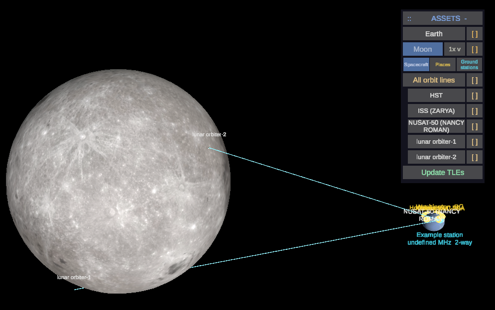
  <br><sub>Both lunar orbiters in contact with the Example station on the Earth. A link line is
  drawn only while the spacecraft is in the station's beam with nothing in the way.</sub>
</p>

## Pipeline

```
tle/<catalog number>.tle         TLEs from any outside source (CelesTrak for the test case)
        |
tools/run_fleet.py               runs GMAT headless: SGP4 propagation of each TLE
        |
data/oem/<catalog number>.oem    one CCSDS OEM per spacecraft (EME2000, 60 s steps,
        |                        1 hour before the run to 12 hours after it)
        v
data/fleet.json                  all spacecraft merged for the viewer, plus GMAT's Earth
        |                        rotation angle and Sun direction for the window
webverse/Scripts/orbit.js        fetches it over HTTP and flies each spacecraft in real time
```

## Layout

```
tle/      input TLEs, one file per spacecraft: name line + the two element lines
spacecraft.xlsx      other spacecraft: Earth / Moon orbiters from elements or OEM files
places.xlsx          places to show on the Earth (cities, sites; see Adding places)
groundstations.xlsx  ground stations: places plus frequency, beam FOV and 1-way / 2-way link
tools/    run_fleet.py (the fleet job), update_tles.py (refresh TLEs from CelesTrak),
          places.py (reads both spreadsheets), serve.py (local server for the viewer, with
          the update action),
          gmat_to_webverse.py (single-orbit demo converter)
gmat/     GMAT scenario scripts (the single-orbit demo)
data/     generated output: OEMs, JSON, the generated GMAT script (not committed)
models/   probe.glb (spacecraft), earth.glb (NASA Blue Marble globe, unit radius),
          moon.glb (NASA LRO LROC colour map + LOLA terrain, unit mean radius; 1x,
          built by tools/make_moon.py, which also builds moon_2x.glb / moon_4x.glb locally),
          probe.glb, probe_2.glb, ... (spacecraft models, see Spacecraft models;
          view/ holds generated camera-free copies, not committed),
          atmosphere.glb (glow shells + night-side caps, unit = Earth radius),
          grid.glb (10 deg latitude / longitude lines, unit = Earth radius),
          select.glb (the white selection square), sun.glb (the Sun: a disc with a soft glow),
          place.glb / station.glb (markers, unit spheres), link_2way.glb / link_1way.glb
          (station-to-spacecraft lines, unit length)
webverse/ the WebVerse world: index.veml (scene) + Scripts/orbit.js (playback, camera)
```

## Running it on your own PC (local server)

BoneStar runs entirely on one machine: a small Python server serves this folder on
`localhost:8000`, and the WebVerse desktop app loads the world from it.

**You need**

- Python 3.11+ with `numpy`, `matplotlib` and `pillow` (`pip install numpy matplotlib pillow`).
- GMAT R2026a, with the `SPICESGP4` plugin enabled in its startup file. The tools expect
  `F:\gmat-win-R2026a\bin\GmatConsole.exe`; set the `GMAT_CONSOLE` environment variable if
  yours is somewhere else.
- The WebVerse desktop app.
- Optional: the lunar terrain maps. `python tools\make_moon.py` downloads them once into
  `data/moon_source/`. Without them, Moon sites use a smooth sphere.

**Steps** (PowerShell, from the project folder)

1. Refresh the data (optional; the viewer's **Update TLEs** button does the same thing):
   ```
   python tools\update_tles.py
   python tools\run_fleet.py
   ```
   `update_tles.py` fetches current TLEs from CelesTrak. `run_fleet.py` runs GMAT headless
   and writes `data/fleet.json`, the orbit lines and the charts.
2. Start the local server, and leave its window open while you use the viewer:
   ```
   python tools\serve.py
   ```
   It serves the project root on port 8000 and handles the viewer's requests: Update TLEs,
   long plot spans and saving plots. If an older copy is still running, stop it (Ctrl+C)
   and start it again so new features load.
3. Open WebVerse and type this into its address bar:
   ```
   http://localhost:8000/webverse/index.veml
   ```
   Don't use a WorldHub `visitworld` link: it forces a WorldHub login first.

**Good to know**

- The viewer shows whatever is in the folder, including changes that aren't committed yet.
- **Spreadsheet edits** (`places`, `groundstations`, `spacecraft`) take effect only after
  **Update TLEs** or `run_fleet.py`. Reloading the world alone doesn't pick them up.
- **Rebuilt models:** WebVerse caches models in
  `%LOCALAPPDATA%\Programs\webverse\wv_cache\http~\localhost~8000\models\` and may keep
  showing the old copy. Delete that model's cached file, then reload. Don't add `?v=N` to a
  model URL: the cache file name becomes invalid on Windows and the world freezes.
- The server writes its log to `data/server.log`.

## Running it

Run the fleet job (needs GMAT R2026a; set `GMAT_CONSOLE` if it isn't at
`F:\gmat-win-R2026a\bin\GmatConsole.exe`):

```
python tools\run_fleet.py
```

It checks each TLE (line length, checksum), writes `data/fleet_run.script`, runs
GmatConsole headless, and writes `data/oem/*.oem`, `data/fleet.json` and the orbit lines
(`data/tracks/`). This is the step to schedule, e.g. every 6 hours after refreshing the TLEs.

To refresh the TLEs first:

```
python tools\update_tles.py
```

It downloads the current TLE for each catalog number in `tle/` from CelesTrak and replaces
a file only if the download is valid (lengths, checksums, catalog number) and newer. The
viewer's **Update TLEs** button runs both steps (see below).

GMAT reads TLEs through its SGP4 propagator plugin (`SPICESGP4`) but does not write them;
it writes the OEM ephemeris files, which carry GMAT's own trajectory.

The same run reports one spacecraft's position in both the inertial and the Earth-fixed
frame, plus the Sun's position (`data/frames.csv`). From these the job works out where the
Greenwich meridian points (the Earth's rotation angle) and where the Sun is, so the viewer
can turn the textured Earth and light its day side correctly. Checked against the standard
sidereal-time formula: within 0.02 deg.

### Viewing it in WebVerse

Start the local server (it serves the project root and runs updates for the viewer), then
open the world directly in the WebVerse address bar:

```
python tools\serve.py
```
```
http://localhost:8000/webverse/index.veml
```

Don't go through a WorldHub `visitworld` link: it forces a WorldHub login first.

Playback starts at the moment the fleet job ran and runs in real time, so run the job just
before viewing for current positions. It holds the last position at the end of the
12-hour window. Scale is 1 unit = 100 km; the spacecraft model is hugely exaggerated so it
stays visible.

What you see:

- **Earth**: NASA Blue Marble (shaded relief and bathymetry), turned to GMAT's rotation angle
  and spinning at the sidereal rate, so each spacecraft is over the right place.
- **Sunlight** from GMAT's Sun direction: a real day side and terminator.
- **The Sun** itself in that direction, with a soft glow, drawn 4x its true size (2.1 deg
  across instead of 0.53, which is only ~10 px on screen).
  It is far beyond what the camera draws (1 AU is ~1.5 million units; the far limit is 10000),
  so it is drawn 9000 units from the camera along the true line of sight -- correct from the
  Moon too -- and the Earth and the Moon pass in front of it (sunrise over a limb, eclipses).
  `SUN_SIZE` in `orbit.js` sets the enlargement (1 = true size).
- **Atmosphere**: a basic blue glow around the limb, brighter on the day side, and a
  darkening night side with a soft terminator.
- **Labels**: each spacecraft's name, facing the camera at any zoom.
- **Assets panel** (top right): click Earth or a spacecraft to centre the view on it; click
  the ASSETS header to collapse it.

<table>
  <tr>
    <td width="50%">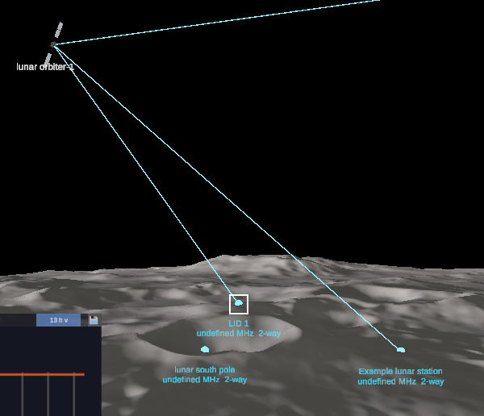<br>
      <sub>Ground view near the lunar south pole: lunar orbiter-1 passes overhead in contact with
      three lunar stations at once. LID 1 is selected (white square).</sub></td>
    <td width="50%">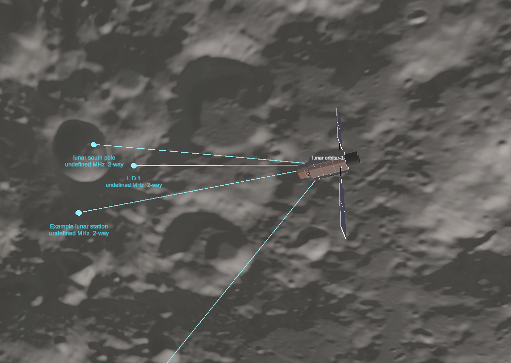<br>
      <sub>Riding along with lunar orbiter-1 over the south pole. Each cyan line is a live link to a
      station; the line leaving the frame goes to a station on the Earth.</sub></td>
  </tr>
</table>

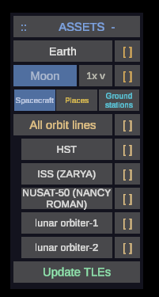

| Control | Action |
|---|---|
| Left-drag | orbit the camera around the current focus |
| W / S, = / - , right-drag | zoom |
| Assets panel tabs | **Spacecraft**, **Places**, **Ground stations**: each lists its objects, 6 at a time (`<` / `>` to page through more) |
| Assets panel name | Earth or a spacecraft: centre the view on it (riding along with a spacecraft); a place or station: centre it as below |
| Left arrow | next spacecraft: the camera rides with it, 1 unit out |
| Right arrow, R | Earth view (starts 4 Earth radii out) |
| G | atmosphere (glow and night side) on / off |
| V (hold) | pie menu, acting on the selection. **Show info**: a panel on the left: a spacecraft's osculating elements (SMA, ECC, INC, RAAN, AOP, TA, argument of latitude, period, apoapsis / periapsis), attitude and next passes, or a place's / station's location, settings, current contacts and next passes. **Show data**: the instrument view (below). **Align camera**: a spacecraft, look along its velocity with its body below. **Align vehicle**: a spacecraft's attitude panel (below) |
| [#] box on the Earth / Moon row, L | 10 deg latitude / longitude grid on that body, turning with it (equator and prime meridian in gold); L: the body in view |
| 1x v box on the Moon row | Moon resolution: 1x, 2x or 4x (see Moon resolution) |
| F | frame rate over the next 15 s, written to the server log (`fps: ...`) |
| Spacecraft [x] box; All orbit lines [x], O | show / hide each spacecraft's orbit (one period, centred on it), or all of them |
| Update TLEs row | fetch fresh TLEs, rerun GMAT, reload the viewer (about 3-20 s) |
| Click a place or ground station (its dot, label or panel row) | select it: a white square marks it and the view locks onto it, fixed to the ground as the Earth turns; drag orbits around it, zoom moves in (to 50 km) and out. Earth, R or the arrow keys leave |
| Ground view row (when a site is selected) | camera 1 km above the site's ground, facing the spacecraft highest in its sky; drag to look around and watch passes overhead. Back to orbit view returns. Nothing within 30 km of the camera is drawn (the camera's near clipping distance) |
| Show places [x] (Places tab), P | places from `places.xlsx` on / off |
| Show ground stations [x] (Ground stations tab) | ground stations and their link lines on / off |

**Orbit lines**: the fleet job writes, per spacecraft, one-orbit lines centred every half
period across the window, and the viewer shows the one centred nearest the current time.
Orbits slowly turn (the ISS's by about 5 deg a day), so a single fixed line would drift off
its spacecraft within hours. Line files are named per run, so WebVerse's model cache never
shows old lines after an update.

**Update TLEs**: asks `tools/serve.py` (`GET /api/update`) to run `update_tles.py` and then
`run_fleet.py`. When it finishes, the viewer reloads `data/fleet.json` in place (positions,
Earth rotation, Sun, orbit lines) and playback restarts at the new run time. The row shows
"Updating...", then "Updated HH:MM UTC" or "Update failed".

Lighting: WebVerse draws the sun's shadows only within 50 units (5,000 km) of the camera, from
a single 2048 px shadow map (set in the runtime; scripts can't change it). That map is far too
coarse for a planet: a lit Earth or Moon shadowed itself and faded to a dull grey as the camera
closed in. So neither is lit by the runtime any more -- both use unlit materials, which receive
no shadows:

- **Earth**: the Blue Marble map as it is, and `atmosphere.glb` draws the night: the glow (four
  see-through blue shells at 38-191 km) and, drawn after them, thirteen flat-black caps at
  223-246 km that darken the night side by 88% in the middle, with a soft terminator; the script
  turns the model so the caps face away from GMAT's Sun.
- **Moon**: the Sun's light is baked into its colour maps (see Moon lighting below).

Spacecraft are still lit by the runtime's sun (intensity 6.25, `SUN_INTENSITY` in `orbit.js`).

### Adding a spacecraft

An Earth orbiter with a TLE: put its TLE in `tle/<catalog number>.tle` and rerun
`python tools\run_fleet.py`.

Anything else (a Moon orbiter, or an Earth orbiter without a TLE) goes in `spacecraft.xlsx`
(or `spacecraft.ods`), sheet **Spacecraft**, one row each:

| Name | Body | Source | Epoch (UTC) | SMA (km) | ECC | INC | RAAN | AOP | TA | OEM file |
|---|---|---|---|---|---|---|---|---|---|---|
| lunar orbiter-1 | Moon | Elements | 01 Oct 2026 00:00:00 | 1837.4 | 0.001 | 90 | 0 | 0 | 0 | |
| lunar orbiter-2 | Moon | Elements | 01 Oct 2026 00:00:00 | 1957.4 | 0.0015 | 90 | 30 | 0 | 0 | |

- **Body**: the body it orbits, Earth or Moon (blank = Earth).
- **Source = Elements**: osculating Keplerian elements at the Epoch, which must be at or before
  the window start (an hour before the run). Earth: EarthMJ2000Eq axes. Moon: the Moon's
  equator of date at the Epoch: Z is the lunar pole at that moment (from GMAT's Moon-fixed
  frame) and X the ascending node of the lunar equator on the Earth's J2000 equator (GMAT's
  `BodyInertial` construction, but with the current pole: it has moved ~3 deg since J2000). So
  INC 90 is a polar lunar orbit today. A short GMAT run gets the Moon's orientation at each
  Epoch and the elements become a Moon-centred MJ2000Eq state for the main run. Lunar
  orbiters' elements in the info panel use the same frame (at each moment). GMAT propagates
  with the body's gravity field (Earth JGM-3 8x8, Moon LP165P 10x10) and the other body and
  the Sun as point masses.
- **Source = OEM**: a CCSDS OEM trajectory file, played back as given, its path in the last
  column (absolute or relative to the project folder). CENTER_NAME EARTH or MOON; REF_FRAME
  EME2000, ICRF or GCRF; TIME_SYSTEM UTC, TAI, TT, TDB or GPS. Moon-centred states get the
  Moon's position added. It should cover the window; outside what it covers the spacecraft
  holds its position. Its orbital elements are computed from the trajectory.

`python tools\spacecraft.py` checks the sheet on its own. Every spacecraft's model (probe.glb),
label and Assets panel row are created automatically; a Moon orbiter's orbit lines are drawn
about the Moon and move with it.

Checked (on the earlier example orbiter, same elements as lunar orbiter-1): a Moon-centred TDB copy of its trajectory, loaded as an OEM, lands
on the original to 0.0 m at every time, and the elements computed from it match GMAT's.
Lunar elements: elements -> state -> elements round-trips to 4e-11; GMAT gets SMA and ECC back
exactly, and for the example (INC 90, AOP 0, TA 0) the spacecraft starts at Moon-fixed Z =
0.000 km, i.e. on the current lunar equator. Its passes over the example station 0.5 deg from
the south pole now peak at ~83 deg (with the J2000 equator they peaked at ~47 deg).

### Spacecraft models

Every 3D model lives in `models/`. `spacecraft.xlsx`, sheet **Models**, says which spacecraft is
drawn with which: Spacecraft (its name or catalog number; TLE spacecraft too), Model (a .glb
file name in `models/`; blank = `probe.glb`) and Scale (multiplies the standard size: 0.5 = half
as long; blank = 1). A spacecraft not listed is drawn with `probe.glb` at scale 1; lunar
orbiter-1 uses `probe_2.glb` at 0.5 and lunar orbiter-2 `probe_3.glb` at 0.1. The file name
must match the file's case exactly (GitHub and web servers are case-sensitive). The camera framing follows the scale, so a small model
can be approached closer (down to 0.45 units, just past the panels). Build a model like `probe.glb`, in the exported file's axes:

- **+X along the velocity**: the front, and the instrument boresight -- the axis the attitude
  modes point (LVLH along the velocity, Nadir at the body below, Sun, Target);
- **the solar arrays along Y** (Blender's Z with the default "+Y Up" glTF export) -- kept on
  the orbit normal by the attitude modes.

Every model is drawn the same length on screen (1.64 units, the probe's; real sizes would make
the ISS 27 times a small probe, thousands of km across at 1 unit = 100 km). Cameras in a model
become instrument views (below). After changing the sheet or a model, press **Update TLEs**; the
viewer swaps the model. WebVerse caches models by URL: after re-exporting a model under the
same name, clear its cached copy (`%LOCALAPPDATA%\Programs\webverse\wv_cache\...\models\`).

### The Moon

GMAT reports the Moon's position and velocity every 60 s, and its orientation (Moon-fixed
frame, with libration), solved from the Earth's and the Sun's directions seen from the Moon in
both frames. Checked: it turns 13.1757 deg/day (sidereal 13.1764) and its 0 deg longitude stays
within 4.2 deg of the Earth (libration). `moon.glb` carries NASA's LRO LROC colour map (SVS CGI
Moon Kit) on a unit sphere laid out like `earth.glb`, raised to the LRO LOLA elevation map at
true scale with normal maps from the same elevation data for the finer slopes; the viewer
scales it to the mean radius (1737.4 km), places and turns it, and shows the copy with the Sun's
light baked in (Moon lighting, below), so it shows its phase. The Assets
panel's **Moon** row centres the view on it. The camera draws out to 10,000 units (1 million
km), so the Moon (~3,800 units away) is always in range.

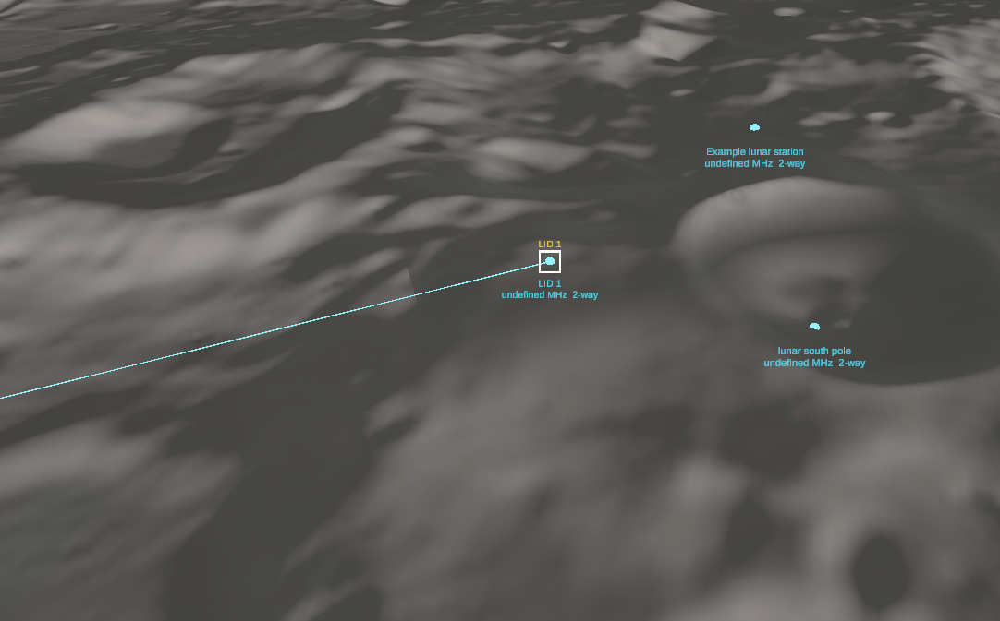
<sub>Low over the lunar south pole. The cap beyond 60 deg is drawn with the polar
(stereographic) maps, so the terrain stays sharp right at the pole, and the low Sun picks out
the crater rims. LID 1 is selected (white square) with a live link; the Example lunar station
and the lunar south pole station sit on the terrain beside it.</sub>

### Moon lighting (baked)

The Moon is drawn unlit, with the Sun's light already in its colour maps (`tools/moon_light.py`):

- **Shading**: each texel's brightness follows the angle between its terrain slope (from the
  LOLA elevation data, as the model's old normal maps) and the Sun, so crater walls facing the
  Sun are bright and the far walls dark.
- **Cast shadows**: from every texel the tool marches 1-300 km across the LOLA elevation map
  toward the Sun, with the Moon's curvature, and keeps the share of the Sun's disc above that
  horizon -- the method `terrain.py` uses for the sites' sunlight. Checked against `terrain.py`
  itself (64 px/deg map, fine steps, 0.5 deg azimuth) at 150 random points within 8 deg of the
  south pole with a grazing Sun: lit / dark agree at 99.3%, mean difference 1.4% of the disc
  (the bake marches the 16 px/deg map; the misses sit on shadow edges).
- **Night side**: a faint 3% fill, so the terrain stays just visible (a stand-in for earthshine).

The Sun is taken at the middle of the viewer's playback (6 h after the run); it moves ~0.5 deg an
hour across the Moon, so the light is up to ~3 deg off at either end of the window. Every fleet run
(and **Update TLEs**) bakes the 1x Moon again (~25 s); 2x and 4x are baked by the local server
the first time you pick them in that run (~80 s and ~2 min; the box says "2x baking"), and need
`tools/serve.py` running. Baked models go to `models/lit/` (not committed), with the run in the
file name since WebVerse caches models by name; the fleet job deletes earlier runs' bakes and
WebVerse's cached copies of them. The baked 4x is 164 MB (the built one 248 MB: no normal maps).

These shadows are for the picture. Assessment figures -- sunlight %, Earth in sight, passes --
come from `terrain.py` at the full 64 px/deg resolution (see Lunar terrain).

### Moon resolution

The Assets panel's Moon row has a small **1x v** drop-down: 1x, 2x or 4x. `tools/make_moon.py`
builds the levels from NASA's CGI Moon Kit (downloaded once into `data/moon_source/`):

| Level | Vertex grid (spacing at the equator) | Triangles | File | Colour / normal maps | Polar maps | Elevation |
|---|---|---|---|---|---|---|
| 1x | 512 x 256 (21 km) | 262k | `models/moon.glb`, 16 MB, committed | 2048 x 1024 | 1024 x 1024 | 16 px/deg |
| 2x | 1024 x 512 (10.7 km) | 1.0M | `models/moon_2x.glb`, 62 MB | 4096 x 2048 | 2048 x 2048 | 16 px/deg |
| 4x | 2048 x 1024 (5.3 km) | 4.2M | `models/moon_4x.glb`, 248 MB | 8192 x 4096 | 4096 x 4096 | 64 px/deg |

2x and 4x are too big for GitHub, so they are built locally: `python tools/make_moon.py 2 4`
(about 1.5 minutes), then **Update TLEs** so the viewer lists them. A level loads in the
background and replaces the shown one when it is in; F logs the frame rate to the server log.

For the full layout at the south pole -- the source files and their encoding, both projections
with a latitude / longitude grid, the mesh rings and tiles, and where each site sits on every
level -- see [docs/lunar-south-pole-layout.md](docs/lunar-south-pole-layout.md) (figure:
`python tools/south_pole_map.py`).

The Moon keeps its own coordinate system at every level: both UV maps are defined by latitude
and longitude, not pixels, so a map of any resolution drops in. **UV0** is equirectangular
(`u = 0.5 + lon/360`, `v = 0.5 - lat/180`) for the band up to 60 deg; **UV1** is polar
stereographic about each pole (PDS / LOLA convention; the image's edge is at 55 deg on its
axes) for the caps beyond 60 deg, one image per pole, which also keeps the normal map well
defined at the pole itself. Lunar sites stand on the terrain of the level shown: at the south
pole the levels differ by up to 3 km (1x vertices are 21 km apart in latitude there), and 4x is
within ~0.3 km of the full 64 px/deg LOLA map at the example sites.

### Adding places

Each spreadsheet row has a **Body** column (places: F, ground stations: I): Earth or Moon,
blank = Earth. Moon sites sit on the lunar surface and turn with the Moon; their
ground elevation is metres above the mean radius (1737.4 km). Leave it blank and it is the
height of the terrain the Moon model draws under the site (LOLA), for each built level, so the
dot sits on the surface you see; passes use the finest level's. A station's link lines and passes also need the line of sight to miss the Earth
and the Moon, so an Earth station tracking a Moon orbiter loses it behind the Moon.

Open `places.xlsx` in Excel (or LibreOffice) and add one row per place on the **Places**
sheet:

| Name | Latitude | Longitude | Altitude AGL (m) | Ground elevation (m) |
|---|---|---|---|---|
| Kennedy LC-39A | 28.608389 | -80.604333 | 0 | |

- **Latitude / Longitude**: decimal degrees, north and east positive. `28.6083 N`,
  `80.6043 W` and degrees-minutes-seconds (`28 36 30.2 N`, `28°36'30.2"N`) also work.
- **Altitude AGL**: metres above the ground there, e.g. an antenna's height. Blank = 0.
- **Ground elevation**: optional, metres above sea level. Leave it blank and it is looked up
  from the Copernicus GLO-90 terrain model (Open-Meteo elevation API, free, no key; needs
  internet the first time, then cached in `data/elevation_cache.json`).

LibreOffice users can keep the file as `places.ods` (its own format) instead: if both
`places.xlsx` and `places.ods` exist, the one saved last is used (the same goes for
`groundstations.ods`), and the job prints which file it read.

Save, then rerun `python tools\run_fleet.py` or press **Update TLEs** in the viewer. Reloading
the world alone is not enough: the spreadsheets are read by the fleet job, not the viewer. Each
place shows as a yellow dot with a yellow label, fixed to the turning Earth. The **Places** tab
of the Assets panel lists them (click one to centre it); its **Show places** [x] box (or
**P**) hides or shows them all. `python tools\places.py`
checks both spreadsheets on their own and names any bad row. Nothing needs installing: the
.xlsx files are read with Python's standard library.

The height used is ground elevation + AGL, taken as height above the WGS84 ellipsoid. Sea
level differs from the ellipsoid by up to about 100 m (the geoid), which is ignored: 0.001
units at the viewer's scale.

### Adding ground stations

`groundstations.xlsx`, sheet **Ground stations**: the same five columns as places, then three
more:

| Name | Latitude | Longitude | Altitude AGL (m) | Ground elevation (m) | Frequency (MHz) | Beam FOV (deg) | Link |
|---|---|---|---|---|---|---|---|
| Example station | 28.608389 | -80.604333 | 10 | | 2250 | 170 | 2-way |

- **Frequency**: operating frequency in MHz (2250 S-band, 8400 X-band, ...).
- **Beam FOV**: the full cone angle the station sees, centred straight up. 180 = horizon to
  horizon; 170 = everything more than 5 deg above the horizon.
- **Link**: `1-way` (the station only receives: downlink) or `2-way` (uplink and downlink).
  The cell has a drop-down.

In the viewer each station is a cyan dot with a two-line label: its name, then its radios' bands and link type (e.g. `S+X-band  2-way`, as in
the chart titles; a station without radio rows shows its Frequency column instead).
Place labels sit centred just above their dot and station labels centred just below theirs
(up and down as seen on screen), so a place and a station at the same spot don't overlap.
While a spacecraft is inside a station's beam, a cyan line joins them: **solid for 2-way,
dashed for 1-way**. The line appears and disappears as the spacecraft enters and leaves the
beam. The **Ground stations** tab lists them; its **Show ground stations** [x] box hides or
shows the stations and their lines.

### Instrument view (Show data)

Spacecraft models can carry instrument cameras. Author the model with a Camera object in it
(in Blender: add a camera, parent it to the model, point it along the instrument's boresight,
set its field of view, and export glTF with cameras included) and save it as
`models/<name>.glb`. The fleet job (`tools/instruments.py`) finds every node of object type
camera, passes its position, pointing and vertical field of view to the viewer, and writes
`models/view/<name>.glb` -- the copy the viewer loads -- with the cameras taken out: WebVerse
loads models with glTFast's default settings, which would turn each glTF camera into a live
Unity camera drawing over the viewer's. Your file is never changed. `models/probe.glb` has one:
"Instrument", at the telescope aperture, looking along the boresight, 10 deg field of view.

**Show data** (spacecraft selected) moves the viewer's camera to the instrument camera, which
follows the spacecraft's attitude (so Nadir or Target modes point it). WebVerse scripts cannot
change the camera's field of view (only X3D worlds can), so a white frame marks the instrument's
own field of view in the ~59 deg view, with a caption; what the instrument sees is inside the
frame. Show data again, Earth / Moon, R, the arrow keys or another spacecraft leave it. A true
picture-in-picture is not possible: the runtime has one camera and no viewport or
render-to-image API for scripts.

### Panels

Every panel and the pie menu are drawn at `UI_SCALE` (0.7) of their original size (one constant
in `orbit.js`). The Assets, info and attitude panels each have a `::` grip: click it (it turns
gold), then drag with the left button and the panel follows; release to drop it. Positions are
not kept across reloads (WebVerse scripts have no storage). Orbit lines, the grids and link
lines are drawn with blended materials at full opacity, because the runtime's sun always casts
shadows from opaque meshes and those lines laid dark bands across the Earth and the Moon.

### Link budgets and charts

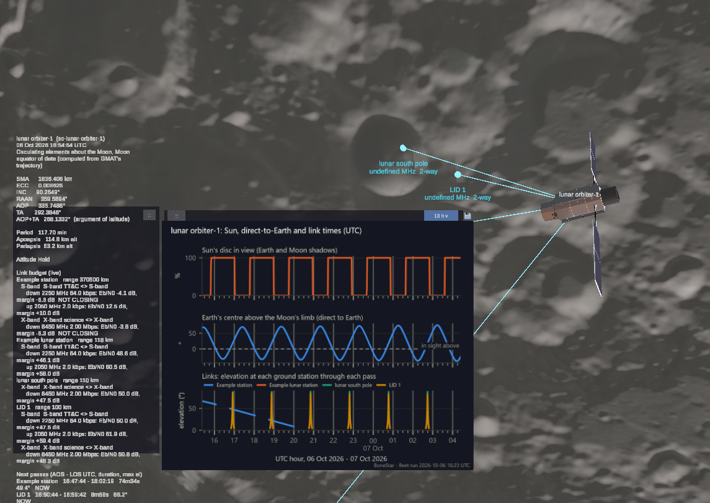
<sub>Show info on lunar orbiter-1. Left: its elements about the Moon, its attitude, then the live
link budget for every station that has it -- per radio, with range, rate, Eb/N0 and margin. The
S- and X-band downlinks to the Example station on the Earth (370,500 km) are flagged NOT
CLOSING; the lunar stations 100-118 km away close with 40-60 dB to spare. Then its next
passes. Right: its plot (see Sun, direct-to-Earth and link plots).</sub>

Links are worked out **radio by radio**, so a spacecraft can carry S-band TT&C, an X-band
science downlink and a Ka-band link at once, and a station can have an antenna per band:

- `spacecraft.xlsx`, sheet **Radios**: one row per radio, by spacecraft name or catalog number
  (TLE spacecraft too): Radio (a name), Downlink (MHz), Uplink (MHz), Tx power (W), antenna gain
  (dBi), downlink rate (bps), required Eb/N0 (dB), Rx G/T (dB/K), uplink rate (bps), other losses.
- `groundstations`, sheet **Station radios**: one row per antenna / band a station supports:
  Station, Radio, Downlink (MHz, what it receives), Uplink (MHz, what it sends on a 2-way link),
  antenna gain (dBi), system noise temperature (K), Tx power (W). A station with no rows there
  still works from its old Frequency column and columns J-L (one radio).

A station radio and a spacecraft radio make a link when their downlink frequencies are in the
same band (IEEE letter bands: L 1-2 GHz, S 2-4, C 4-8, X 8-12, Ku 12-18, K 18-27, Ka 27-40).
Each link gets its own budget: the downlink at the spacecraft radio's downlink frequency, the
uplink at its uplink frequency (a blank one takes the other end's). `tools/linkbudget.py` holds
the equations (free space, clear sky: EIRP, path loss, G/T, C/N0, Eb/N0, margin); checked by hand
(S-band at 1000 km: 159.49 dB path loss; the uplink at 2050 MHz: 158.68 dB) and against the
viewer's own code, run as is in a JavaScript engine: the same radio pairs and margins to 1e-13 dB
over 10,000 random cases (14,690 radio pairs).

**Show info** on a station lists its radios and, for every spacecraft in its beam, the range and
each shared band's downlink (and, for 2-way, uplink) frequency, rate, Eb/N0 and margin, live,
flagged "NOT CLOSING" below 0 dB; on a spacecraft, the same for every station that has it.

<table>
  <tr>
    <td width="34%" valign="top">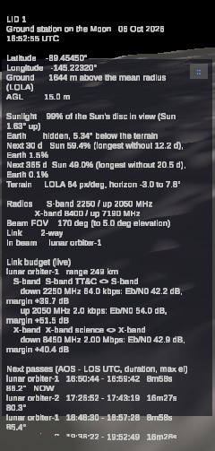<br>
      <sub>Show info on LID 1, a station at the lunar south pole: where it is, its sunlight and
      Earth visibility (now, 30 days, a year), its two radios, the live budget to lunar
      orbiter-1 on each band, and the next passes.</sub></td>
    <td width="66%" valign="top">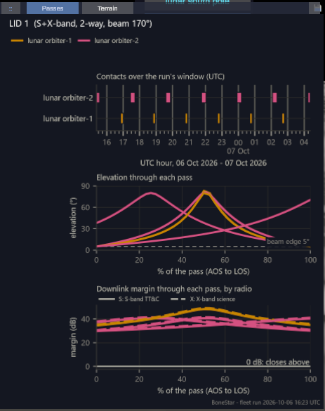<br>
      <sub>LID 1's Passes chart: contacts with both orbiters over the run's window, elevation
      through each pass, and downlink margin through each pass -- solid S-band, dashed
      X-band -- all well above 0 dB.</sub></td>
  </tr>
</table>

The fleet job also draws a chart per station with matplotlib (`tools/charts.py`): its contacts
over the window, elevation through each pass and downlink margin through each pass, one line
per radio (colour: the spacecraft; line style: the radio), each against the share of the pass
(AOS to LOS), with the beam edge and the 0 dB line. The viewer
shows the selected station's chart in a panel at the bottom right while Show info is open
(`::` grip to move it). Checked: the charts' geometry reproduces every pass's peak elevation to
0.005 deg, and every pass starts and ends at the beam edge or where the Earth / Moon blocks it.

### Attitude modes (Align vehicle)

Each spacecraft model turns toward its mode's attitude at no more than 10 deg/s. The
boresight is the telescope's aperture end of `probe.glb` (its +X); the solar arrays run along
its Y.

| Mode | Boresight | Arrays |
|---|---|---|
| Sun | at the Sun | along the orbit normal |
| LVLH | along the velocity (ram); fixed in the local-vertical / local-horizontal frame | along the orbit normal |
| Nadir | at the Earth's centre | along the orbit normal |
| Zenith | straight away from the Earth | along the orbit normal |
| Normal | along the orbit normal (r x v) | along the velocity |
| Target | at a place, ground station or spacecraft, held as both move | along the orbit normal |
| Hold | keeps its current attitude (every spacecraft starts here) | |

For Target, choose Target, then select the target (click a place or station, or a spacecraft's
row in the Assets panel): the view stays where it is.

### Passes

`run_fleet.py` finds every pass of every spacecraft through every ground station's beam over
the window (AOS / LOS to 0.05 s, peak elevation), with the same beam test and Earth rotation
the viewer uses for link lines. Checked against GMAT's own ContactLocator (5 deg mask, i.e. a
170 deg beam) for the example station: the same 4 passes, AOS and LOS within ~1 s, durations
within 0.3 s (the viewer turns the Earth about the J2000 pole, ~0.15 deg from the true pole).

### Lunar terrain: sunlight and line of sight

For every site on the Moon, `tools/terrain.py` works out from the LRO LOLA elevation map
(64 px/deg, ~470 m; downloaded by `tools/make_moon.py` into `data/moon_source/`):

- **Horizon mask**: the terrain's elevation angle every 0.25 deg of azimuth, marched out 600 km
  along each great circle with the Moon's curvature, from the site's eye (LOLA ground + its
  height above the ground). A blank ground elevation in the spreadsheet is LOLA's.
- **Sunlight**: the share of the Sun's disc (its true size) above the terrain, now and over the
  next 30 days (5 min steps) and 365 days (30 min steps): time in sunlight, whole disc, mean
  disc and the longest stretch without Sun (for battery sizing).
- **Earth in sight**: the Earth's centre above the terrain (direct-to-Earth links), the same way.
- **Passes**: a Moon station's passes also need the spacecraft above its terrain horizon, and
  each AOS / LOS says what set it (`aos_by` / `los_by`: beam, terrain, body or window). The
  viewer draws link lines with the same test, and marks terrain-limited passes.

Show info on a Moon site lists the figures, and the chart panel shows its terrain chart: the
horizon with the Sun's and the Earth's paths, the Sun's disc in view and when the Earth is in
sight (a Moon ground station has a **Passes / Terrain** switch).

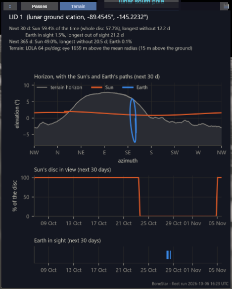

LID 1's Terrain chart (right). Top: the terrain horizon all around the site (grey), with the
Sun's path (orange) circling low, 1-2 deg up, and hidden behind the ridge to the east; the
Earth's path (blue) loops in the south-east, mostly behind the same ridge. Middle: the Sun is in view for most of the next 30 days, then the ridge
hides it for about 12 days. Bottom: the Earth clears the ridge only briefly (1.5% of the time),
so this site needs a relay -- the lunar orbiters -- to reach the Earth.

<br clear="right">

**Frames.** LOLA, LROC and the sites' coordinates use the Moon's Mean Earth frame (MOON_ME);
GMAT's Moon-fixed axes are principal axes (MOON_PA). The fleet job turns GMAT's Moon-fixed
directions into MOON_ME: a constant 103.85" rotation (~0.9 km at the surface), checked against
GMAT run on SPICE MOON_PA and MOON_ME (match to 0.0000"). GMAT's default lunar axes (DE405)
differ from SPICE's DE421 MOON_PA by another ~5" (~43 m), which is left as is.

**Checks.** The equatorial nearside has the Sun 48.8% of the year and the Earth 100%; the
farside never sees the Earth. At 89.5 S the Sun stays within +-2.0 deg of the horizontal (the
1.54 deg lunar obliquity plus 0.5 deg from the pole). Shackleton's floor gets no Sun all year.
The best-lit points found around the south pole (e.g. 89.77 S 156 W, 88% of the year at 2 m)
are in line with the ~85-90% published for the best south-pole sites. The disc share is within
0.25% of the exact geometry; the horizon march moves sunlight figures by under 0.2 points
against 2-4x finer steps. Within one LOLA pixel (~470 m) the map has no detail, so a horizon set
by very close terrain carries ~0.2 deg of uncertainty; published south-pole studies use 20-240 m
polar maps, which drop in through the same polar coordinate system (see Moon resolution).

### Sun, direct-to-Earth and link plots

With Show info open on a Moon site, a ground station or a spacecraft, an XY plot (matplotlib,
`tools/charts.py` `timeline_chart`, made by the fleet job) hangs under the info panel and moves
with it (its own "::" grip moves it apart). Over the run's window, on one UTC axis:

<table>
  <tr>
    <td width="42%" valign="top">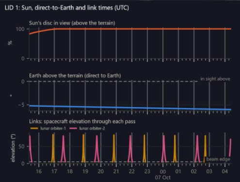<br>
      <sub>A Moon station (LID 1): the Sun stays in view, the Earth stays about 5 deg below
      the terrain all window, and the two orbiters pass overhead every hour or two.</sub></td>
    <td width="58%" valign="top">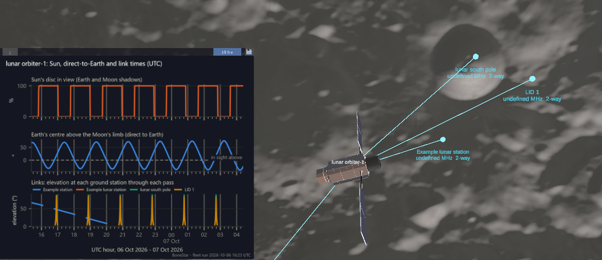<br>
      <sub>A spacecraft (lunar orbiter-1): sunlight with an eclipse each orbit, the Earth rising
      and setting over the Moon's limb (direct to Earth above the dashed line), and its passes
      over each station.</sub></td>
  </tr>
</table>

- **Sun**: the share of the Sun's disc in view -- above the terrain for a Moon site; past the
  Earth's and the Moon's shadows (umbra and penumbra) for a spacecraft. Checked against GMAT's
  EclipseLocator for the example lunar orbiter: all 28 umbra / penumbra edges in the window
  within 0.1 s.
- **Direct to Earth**: the Earth's elevation above the terrain (Moon sites) or above the Moon's
  limb (lunar spacecraft); in sight above 0.
- **Links**: the elevation through each pass, per spacecraft (stations) or per station
  (spacecraft), with the beam edge.

The span box next to the save icon switches the plot between **13 h** (the fleet run's window),
**Week**, **Month**, **6 mo** and **Year**; the save icon saves the span shown. The longer spans
are drawn on request by the local server (`/api/plot`, `tools/plots.py`) and kept until the next
fleet run:

- **Moon sites**: the Sun and the Earth over the span, from the terrain module's 30-day and
  365-day series.
- **Links and spacecraft sunlight / direct to Earth**: from a longer GMAT propagation
  (`tools/longrun.py`), run on the first request: 30 days at 60 s (Week, Month; ~25 s) or 365
  days at 120 s (6 months, Year; ~2.5 min) -- the viewer says so while it waits. Spacecraft from
  elements continue from the fleet run's own state at "now" with the same force models; TLE
  spacecraft are propagated a week only (their predictions drift by kilometres a day), and their
  lines stop there, marked "TLE: 7 d"; OEM spacecraft use their file. A lunar spacecraft that
  reaches the surface is cut off there. The geometry is the pass finder's (beam edge, Earth / Moon
  in the way, the Moon stations' terrain), on whole arrays. Checked against the fleet run over the
  12 hours they share: identical TLE and Moon positions, the lunar orbiter within 76 m, all 64 pass
  edges within the 30 s sampling, identical sunlight.
- A week shows each 3 hours' total, a month and longer each UTC day's: the share of the time in
  sunlight or with the Earth in view, and the time in contact on each link (the 13 h view keeps the
  orbit-by-orbit curves).

Each span has its own axis: 13 h -- a tick every quarter hour, bold every hour; week -- every
6 h, bold every day; month -- every day, bold every Monday; 6 months and a year -- every Monday,
bold every month.

For the 13 h view: every time-of-day axis follows one standard: a tick every quarter hour, a bold line and a label
on every hour in 24-hour form (with the date at midnight), and the date in the axis title; each
chart carries the fleet run's time along the bottom. PNGs are drawn at 400 dpi (a plot is
2000 x 1600 px).

The save icon (top right of this panel and of the chart panel) has the local server copy the
plot as PNG and SVG into `exports/` (named after the plot and the UTC time saved; not
committed). It needs `python tools/serve.py` running.

### How a chart is made

Every chart and plot in the viewer is drawn outside WebVerse, in Python, and shown as a picture:

1. **Geometry.** The fleet job (`run_fleet.py`) works out the numbers from GMAT's trajectories:
   passes, elevations, link margins (`linkbudget.py`), sunlight and Earth visibility
   (`terrain.py` for Moon sites). Longer spans come from `longrun.py` on request.
2. **Drawing.** `tools/charts.py` draws each chart with matplotlib in one house style: dark
   background, one colour per spacecraft or station, quarter-hour ticks with a bold line and
   label every hour, the UTC date in the axis title, and the fleet run's time in the footer. It
   writes a 400 dpi PNG, an SVG of the same chart, and a `.glb` with the picture on a flat
   square, all into `data/charts/`.
3. **Showing it.** The viewer puts that `.glb` on its panel. It doesn't use WebVerse's own
   image element, which fails in this runtime after the first world is unloaded.
4. **Keeping it.** The save icon has `serve.py` copy the PNG and SVG into `exports/`, ready for
   a report or slide.

## JSON shape

```json
{
  "epoch": "01 Oct 2026 07:36:00.000",
  "generated": "01 Oct 2026 08:36:00.000",
  "generated_t": 3600.0,
  "earth": { "rotation_deg": 262.58, "rate_deg_per_s": 0.0041780746 },
  "sun_dir": [-0.9898, -0.1308, -0.0567],
  "names": { "25544": "ISS (ZARYA)", "20580": "HST" },
  "tracks": { "25544": { "colour": [1, 0.62, 0.2], "period": 5577.0,
                         "segments": [ {"file": "data/tracks/25544_<run>_00.glb", "t": 2788.5}, ... ] } },
  "moon": { "radius_km": 1737.4, "samples": [[t, x, y, z, vx, vy, vz, qx, qy, qz, qw], ...] },
  "craft": { "25544": {"body": "Earth", "source": "tle", "model": "probe.glb"},
             "sc-example-lunar-orbiter": {"body": "Moon", "source": "elements", "model": "probe.glb"} },
  "instruments": { "probe.glb": [ {"name": "Instrument", "pos": [-4, 0, 0], "fwd": [-1, 0, 0],
                                   "up": [0, 1, 0], "yfov_deg": 10.0, "aspect": 1.0} ] },
  "places": [ {"name": "Kennedy LC-39A", "body": "Earth", "lat": 28.608389, "lon": -80.604333, "agl_m": 0.0,
               "ground_m": 6.0, "ecef_km": [914.820725, -5528.578756, 3035.871127]} ],
  "ground_stations": [ {"name": "Example station", ... same fields ..., "freq_mhz": 2250.0,
                        "fov_deg": 170.0, "link": "2-way"} ],
  "elements": { "25544": { "fields": ["t", "sma", "ecc", "inc", "raan", "aop", "ta", "period", "rapo", "rper"],
                           "rows": [[t, ...], ...] } },
  "passes": [ {"station": "Example station", "catalog": "20580", "name": "HST", "aos": 30243.1,
               "los": 30717.8, "max_t": 30480.6, "max_el": 19.91} ],
  "objects": {
    "25544": [
      {"t": 0, "pos": [x, y, z], "vel": [vx, vy, vz]},
      ...
    ]
  }
}
```

`t` is seconds after `epoch` (UTC); positions are km and velocities km/s in EarthMJ2000Eq.
`generated_t` is where the run time falls in the window, and is where playback starts.
`earth.rotation_deg` is the Greenwich meridian's angle from +X at `epoch`; `sun_dir` is a
unit vector toward the Sun at run time. `tracks` lists each spacecraft's orbit-line files and
the time (`t`, seconds after `epoch`) each one is centred on. `elements` are GMAT's osculating elements every 60 s (SMA, ECC, TA, period and apsis radii about the Earth; INC, RAAN, AOP in EarthMJ2000Eq; km, deg, s). `places` and `ground_stations`
come from the two spreadsheets; `ecef_km` is the Earth-fixed WGS84 position, which the viewer
turns by the Earth's rotation angle.

## Also included: single-orbit demo

`gmat/orbit_default.script` propagates one spacecraft from 17 Sep 2026 12:00 UTC in a
45 deg LEO test orbit (perigee altitude 350 km, eccentricity 0.02) for one full orbit:

```
"F:\gmat-win-R2026a\bin\GmatConsole.exe" --run gmat\orbit_default.script
python tools\gmat_to_webverse.py data\orbit_default.txt SC data\orbit_default.json
```

The viewer now reads `data/fleet.json`, not this demo's output.

## Status

Working locally for the ISS and Hubble.

Known issues:

- **The night side can vanish** depending on camera position (it can flip on and off as the
  camera orbits or zooms, e.g. close to a spacecraft over the night side). Being looked into.
  Findings so far: this WebVerse build doesn't render transparency that comes from a texture;
  its see-through materials write depth; and separate see-through models are drawn in order of
  camera distance. Merging the glow and the night caps into one model did not remove the flip.
- The atmosphere glow looks stepped up close (from a spacecraft view the four shells show as
  separate bands); more, thinner shells would smooth it.
- The Earth texture (4096 x 2048, ~10 km per pixel) is soft up close, and the surface sheen
  makes it look darker when viewed straight down than at a slant.
- WebVerse caches models (`%LOCALAPPDATA%\Programs\webverse\wv_cache\`) and may keep an old
  copy after a model changes; delete the cached file to force a fresh download. (Don't add
  `?v=...` to model URLs: the cache can't store the name and the world fails to load.)

Not built yet: a real-time clock sync (the viewer counts forward from the job's run time,
so press Update TLEs, or rerun the fleet job, to bring it back to "now") and scheduling the
fleet job. Ideas for later are kept in [docs/FUTURE_IDEAS.md](docs/FUTURE_IDEAS.md).

The Assets panel is drawn on a world-space canvas kept in front of the camera. Screen-space
panels (HTML) were tried first and never became visible in this runtime.

## Credits

Earth imagery: NASA Blue Marble, served by NASA GIBS (layer
`BlueMarble_ShadedRelief_Bathymetry`). Moon imagery: NASA LRO LROC WAC colour map and LRO LOLA
elevation map (`ldem_16`), from the NASA Scientific Visualization Studio CGI Moon Kit.

## License

MIT, see [LICENSE](LICENSE).
