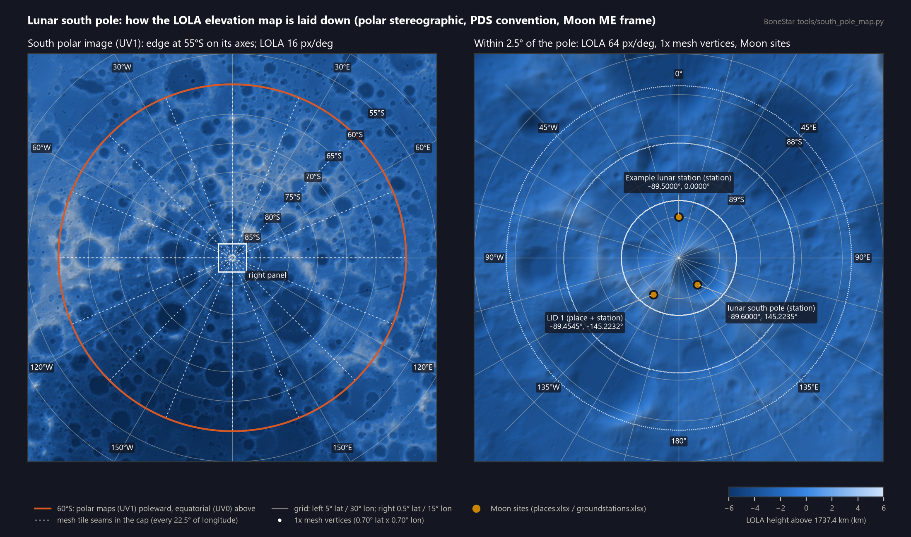

# Lunar south pole: how the LOLA elevation map is laid down

This note covers how BoneStar puts NASA's lunar elevation and colour maps onto the Moon model,
with the south pole as the worked example. It covers the source files, the coordinate frame,
the two projections, the mesh grid, where the sites sit, and what the analysis uses instead of
the mesh.



Regenerate the figure with `python tools/south_pole_map.py`. It reads the same files and calls
the same projection functions as `tools/make_moon.py`, so the picture is the layout itself, not
a sketch of it.

## Sources

All from NASA SVS 4720, the CGI Moon Kit (public domain), downloaded once into `data/moon_source/`:

| File | What | Grid | Used for |
|---|---|---|---|
| `ldem_16_uint.tif` | LRO LOLA elevation | 5760 x 2880, 16 px/deg (1.9 km at the equator) | 1x and 2x mesh heights; the baked shadows' horizon march |
| `ldem_64_uint.tif` | LRO LOLA elevation | 23040 x 11520, 64 px/deg (474 m) | 4x mesh heights; all terrain analysis (`tools/terrain.py`) |
| `lroc_color_poles_2k/4k/8k.tif` | LRO LROC WAC colour | 2048 / 4096 / 8192 wide | the colour maps of 1x / 2x / 4x |

**Elevation encoding:** 16-bit unsigned, half-metres. The height in km above the 1737.4 km
mean radius is `value / 2000 - 10`. Row 0 is 90°N and column 0 is 180°W, with pixel centres at
the half-steps.

**Frame:** the maps and every site coordinate use the Moon's Mean Earth frame (MOON_ME).
GMAT's Moon-fixed axes are principal axes (MOON_PA), so the fleet job turns them into MOON_ME
with a fixed 103.85" rotation (~0.9 km at the surface). That rotation matches GMAT running on
SPICE MOON_PA / MOON_ME to 0.0000".

## Two projections, one coordinate system

Every mesh vertex carries two texture coordinates, both defined by latitude and longitude rather
than pixels, so a map of any resolution drops in:

- **UV0, equatorial** (equirectangular): `u = 0.5 + lon/360`, `v = 0.5 - lat/180`.
- **UV1, polar** (polar stereographic about the vertex's own pole, PDS / LOLA convention on the
  unit sphere). For the south pole:

  ```
  x = 2 tan(45° + lat/2) · sin(lon)
  y = 2 tan(45° + lat/2) · cos(lon)
  u = 0.5 + x / (2E),   v = 0.5 - y / (2E),   E = 2 tan(17.5°) = 0.630598
  ```

  So 0° longitude points up the image and 90°E to the right. The image's edge is at 55°S on its
  axes, and its corners reach ~47°S.

**Which one is drawn:** poleward of **60°S** (the orange circle in the figure), the mesh uses
the polar maps, one square image per pole. Between 60°S and 60°N it uses the equatorial maps.
The polar images are resampled from the equirectangular source maps, bilinear in latitude /
longitude. This keeps the texture undistorted right at the pole, where equirectangular columns
converge to a point.

## The mesh

The mesh is a latitude / longitude grid of vertices. Each vertex sits at radius `1 + h / 1737.4`,
where `h` is the LOLA height sampled bilinearly at the vertex's latitude and longitude. The
vertices on the pole row all take the mean of LOLA's polar row, so the fan closes.

| Level | Vertices (lon x lat) | Row spacing | Last ring before the pole | Vertex gap on that ring | Elevation map |
|---|---|---|---|---|---|
| 1x | 512 x 256 | 0.703° (21.3 km) | 89.297°S | 0.26 km | 16 px/deg |
| 2x | 1024 x 512 | 0.352° (10.7 km) | 89.648°S | 0.07 km | 16 px/deg |
| 4x | 2048 x 1024 | 0.176° (5.3 km) | 89.824°S | 0.02 km | 64 px/deg |

- **Spacing near the pole:** the rows are evenly spaced in latitude, so near the pole the
  vertices are very dense along each ring and sparse between rings. The right panel shows the
  1x rings at 87.89°S, 88.59°S and 89.30°S. Anything between the last ring and the pole is
  drawn as one fan of triangles.
- **Tiles:** the grid is cut into tiles 30° of latitude by 22.5° of longitude (16 per band;
  the dashed seams in the figure). That keeps each tile under 65,536 vertices for 16-bit
  indices, and lets Unity skip tiles out of view. The south cap is the 60°S–90°S band.
- **Shading:** vertex normals are the sphere's. The slopes come from normal maps baked from the
  same LOLA data, so they aren't counted twice. In the viewer, the Sun's light and the terrain's
  cast shadows are baked into the colour maps (`tools/moon_light.py`).

## Where the sites sit

A site's height comes from the terrain of the level shown, so its dot stands on the surface
you see. The analysis uses LOLA 64 px/deg directly.

| Site | Lat, lon | LOLA 64 px/deg | 1x mesh | 2x mesh | 4x mesh |
|---|---|---|---|---|---|
| LID 1 (place + station) | -89.4545°, -145.2232° | +1644 m | +1251 m | +1286 m | +1617 m |
| Example lunar station | -89.5000°, 0.0000° | -729 m | -333 m | -637 m | -727 m |
| lunar south pole (station) | -89.6000°, +145.2235° | -2414 m | +848 m | -2055 m | -2132 m |

Heights are metres above 1737.4 km, ground only. The places / stations sheets add the antenna's
height above the ground (AGL) on top.

The 1x mesh is up to 3.3 km off at the south pole. Its last ring is 21 km from the next one
inward, so it can't follow crater floors like the lunar south pole station's. 4x is within
~0.3 km of the 64 px/deg map. **Visual only:** passes, sunlight, line of sight and link figures
never use the mesh.

## What the analysis uses instead

`tools/terrain.py` works from the 64 px/deg LOLA map directly, in MOON_ME:

- **Eye height:** each site's eye is LOLA ground + its AGL.
- **Horizon mask:** every 0.25° of azimuth, marching each great circle out to 600 km with the
  Moon's curvature. Steps are 25 m out to 25 km, then 0.1% of the distance.
- **Sun and Earth visibility:** the Sun's disc share and the Earth's clearance are worked out
  against that mask.

The baked shadows on the viewer's Moon use the same method on the 16 px/deg map and agree with
`terrain.py` on lit / dark at 99.3% of 150 random points within 8° of the pole.
